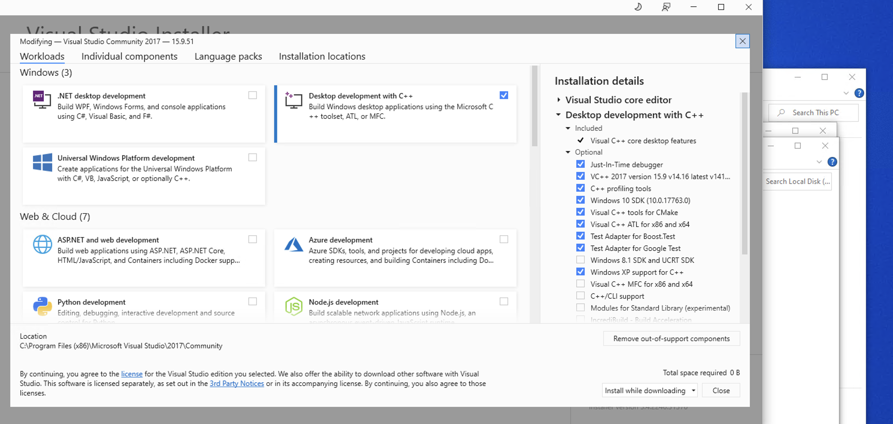
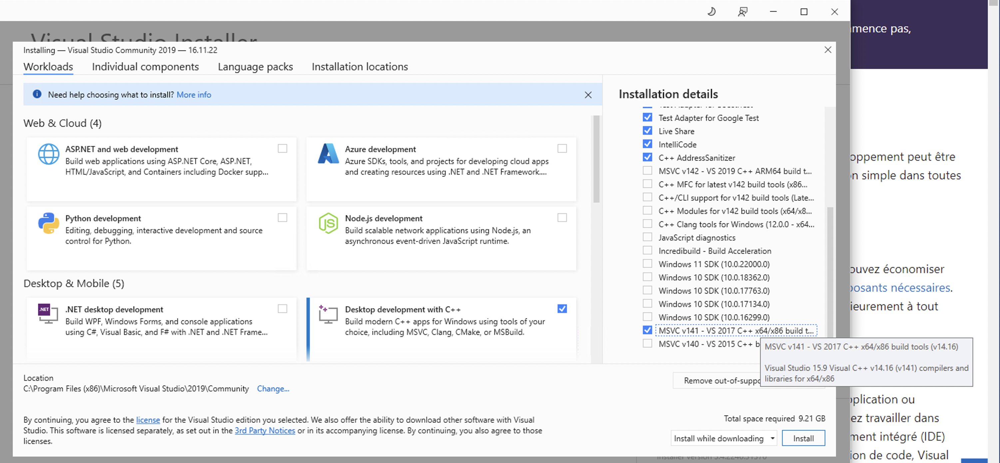

# Github Action

## Theory

[https://blog.gentilkiwi.com/programmation/msbuild](https://blog.gentilkiwi.com/programmation/msbuild)

## pipeline

- Install Windows 2022
- Install Visual Studio 2019

## troubleshooting

### signature

```
Set-ExecutionPolicy -ExecutionPolicy Unrestricted -Scope LocalMachine -Force
Get-ExecutionPolicy -List
```

```
PS C:\actions-runner\_work\mimikatz\mimikatz> Get-ExecutionPolicy -List

        Scope ExecutionPolicy
        ----- ---------------
MachinePolicy       Undefined
   UserPolicy       Undefined
      Process       Undefined
  CurrentUser       Undefined
 LocalMachine    Unrestricted
```

### v141_xp support 



 

### Microsoft.Cpp.Redirect.14.props
