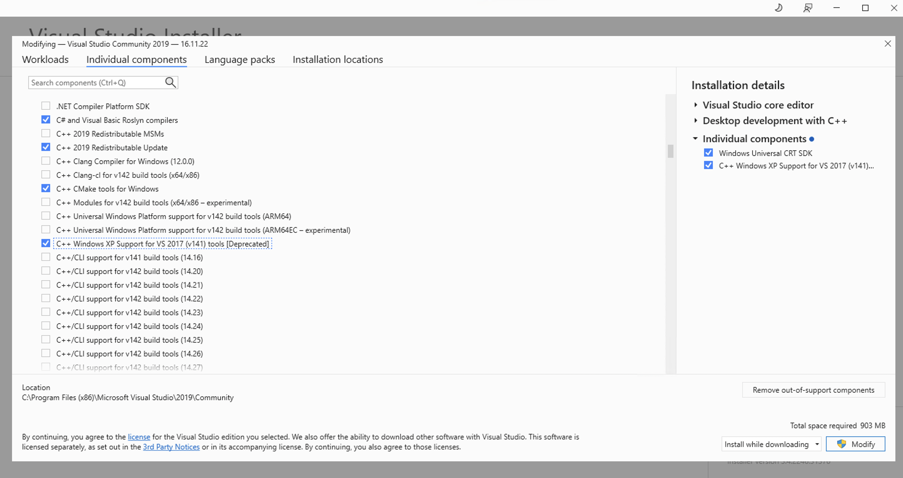

# Github Action

## Theory

[https://blog.gentilkiwi.com/programmation/msbuild](https://blog.gentilkiwi.com/programmation/msbuild)

## pipeline

- Install Windows 2022
- Install Visual Studio 2019

## troubleshooting

### signature

```
Set-ExecutionPolicy -ExecutionPolicy Unrestricted -Scope LocalMachine -Force
Get-ExecutionPolicy -List
```

```
PS C:\actions-runner\_work\mimikatz\mimikatz> Get-ExecutionPolicy -List

        Scope ExecutionPolicy
        ----- ---------------
MachinePolicy       Undefined
   UserPolicy       Undefined
      Process       Undefined
  CurrentUser       Undefined
 LocalMachine    Unrestricted
```

### v141_xp support 

[https://developercommunity.visualstudio.com/t/windows-xp-platform-tools-support-in-visual-studio-2019/1196734](https://developercommunity.visualstudio.com/t/windows-xp-platform-tools-support-in-visual-stud)

 

### Microsoft.Cpp.Redirect.16.props

```
"C:\actions-runner\_work\mimikatz\mimikatz\mimikatz.sln" (Rebuild target) (1) ->
"C:\actions-runner\_work\mimikatz\mimikatz\mimidrv\mimidrv.vcxproj" (Rebuild target) (4) ->
  C:\Program Files (x86)\Microsoft Visual Studio\2019\Community\MSBuild\Microsoft\VC\v160\Microsoft.Cpp.Redirect.props(21,3): error MSB4019: The imported project "C:\Microsoft.Cpp.Redirect.16.props" was not found. Confirm that the expression in the Import declaration "\Microsoft.Cpp.Redirect.16.props" is correct, and that the file exists on disk. [C:\actions-runner\_work\mimikatz\mimikatz\mimidrv\mimidrv.vcxproj]
```

test1

> set VCTargetsPath environment variable to 
> C:\Program Files (x86)\Microsoft Visual Studio\2019\BuildTools\Common7\IDE\VC\VCTargets

[https://stackoverflow.com/questions/63540048/where-exactly-is-macro-vctargetspath-defined](https://stackoverflow.com/questions/63540048/where-exactly-is-macro-vctargetspath-defined)